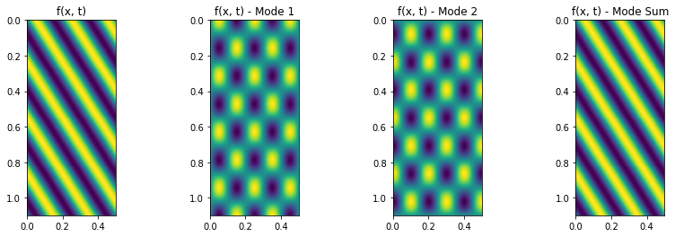
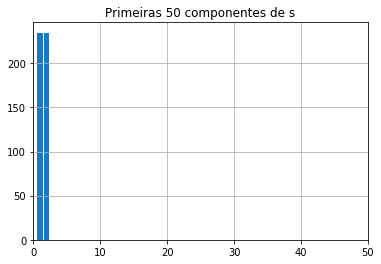
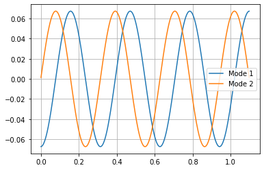
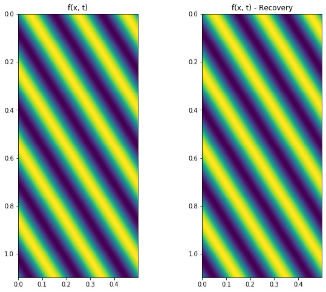

### Sumário

- Onda viajante e modos ortogonais
- Decomposição com SVD
- Reconstrução com modos ortogonais


```python
import numpy as np
import matplotlib.pyplot as plt
```

### Onda viajante e modos ortogonais

Vamos analisar a decomposição de um sinal em modos ortogonais com POD (proper orthonal decomposition). Para isso, vamos analisar uma onda viajante descrita pela seguinte função:

$f(x, t) = sin(wt - kx)$

Usando as relações trigonometricas podemos reescrever a função como a combinação de dois modos espaciais ortogonais.

$f(x, t) = sin(wt)cos(-kx) + cos(wt)sin(-kx)$


Os modos são $cos(-kx)$ e $sin(-kx)$


```python
# Traveling wave parameters
freq = 5
w = 2*np.pi*freq
k = 20 # spacial frequency

fs = 1000; # temporal frequency
fs_space = 400
x = np.arange(0, 1.1, 1/fs_space)
t = np.arange(0, 0.5, 1/fs)

```


```python
x.shape, t.shape, f.shape
```


    ((440,), (500,), (440, 500))


```python
tv, xv = np.meshgrid(t, x)
```


```python
f = np.sin(w*tv - k*xv)
```


```python
# Orthogonal modes
f_mode1 = np.sin(w*tv)*np.cos(-k*xv)
f_mode2 = np.cos(w*tv)*np.sin(-k*xv)
```

Podemos verificar se os modos são de fatos ortogonais fazendo o produto escalar entre os modos.


```python
np.max(np.abs(np.dot(f_mode1.T, f_mode2)))
```


    0.0036426775042865955


Podemos visualizar a função f(x, t), seus 2 modos e como a soma desses modos ponderada pela variação temporal reconsitui a função original.


```python
fig, axs = plt.subplots(1, 4, figsize = (14, 4))
axs[0].imshow(f, extent=[min(t), max(t), max(x), min(x)])
axs[0].set_title("f(x, t)")
axs[1].imshow(f_mode1, extent=[min(t), max(t), max(x), min(x)])
axs[1].set_title("f(x, t) - Mode 1")
axs[2].imshow(f_mode2, extent=[min(t), max(t), max(x), min(x)])
axs[2].set_title("f(x, t) - Mode 2")
axs[3].imshow(f_mode1 + f_mode2, extent=[min(t), max(t), max(x), min(x)])
axs[3].set_title("f(x, t) - Mode Sum")
```


    Text(0.5, 1.0, 'f(x, t) - Mode Sum')





### Decomposição com SVD

Podemos recuperar os modos a partir dos dados com POD, para isso decompomos a matriz $f$ em modos singulars com SVD.


```python
[u, s, v] = np.linalg.svd(f, full_matrices=False)
```

A decomposição em valores singulares gera três matrizes $U$, $S$ e $V$. 

Tal que as colunas de $U$ representam uma base para ortogonal para as colunas de $f$ e as linhas de $v$ representam uma base ortogonal para as linhas de $f$.

A matriz $S$ é uma matriz diagonal, na qual os elementos da diagonal representam os valores singulares que podem ser interpretados como a energia $f$ contina nos modos presentes nas colunas e linhas de $U$ e $V$.

Podemos ver que as matrizes $U$ e $V$ são ortogonais calculando o seguinte produto de todas as linhas com todas as colunas e verificando que obtemos uma matriz diagonal (neste caso em particular a matriz identidade).


```python
UU = np.dot(u.T, u)
np.allclose(UU, np.eye(len(UU)))
```


    True


```python
VV = np.dot(v.T, v)
np.allclose(UU, np.eye(len(UU)))
```


    True


Porém para representarmos a função $f$, podemos manter somente os modos espaciais (colunas de $U$) com energia significativa. Isso pode ser medido pela amplitudo dos elementos de $s$.


```python
plt.bar(np.arange(1, 1+len(s)), s)
plt.title("Primeiras 50 componentes de s")
plt.xlim([0, 50])
plt.grid()
```





Como esperado somente os dois primeiros modos tem coeficientes diferentes de 0, isso mostra que todo a função $f$ pode ser representada por apenas dois modos espacias, como esperado teoricamente. Esses modos são:


```python
# duas primeiras colunas de U
mode1 = u[:, 0]
mode2 = u[:, 1]
```


```python
plt.plot(x, mode1)
plt.plot(x, mode2)
plt.legend(["Mode 1", "Mode 2"])
plt.grid()
```





### Reconstrução com modos ortogonais

Como toda a energia esta contida somente nos dois primeiros modos, podemos representar todo o sinal de forma bem mais enxuta. Utilizando somente os dois modos ortogonais.

Vamos verificar que a função recuperada a partir desses dois modos é igual a função original.


```python
# numero de componentes mantidas
n_reduct = 2
```


```python
u_reduc = u[:, 0:n_reduct]
```


```python
s_reduc = np.diag(s)[0:n_reduct, 0:n_reduct]
```


```python
v_reduc = v[0:n_reduct, :]
```


```python
f_recoverd = np.dot(np.dot(u_reduc, s_reduc), v_reduc)
```


```python
fig, axs = plt.subplots(1, 2, figsize = (10, 8))
axs[0].imshow(f, extent=[min(t), max(t), max(x), min(x)])
axs[0].set_title("f(x, t)")
axs[1].imshow(f_recoverd, extent=[min(t), max(t), max(x), min(x)])
axs[1].set_title("f(x, t) - Recovery")
```


    Text(0.5, 1.0, 'f(x, t) - Recovery')




