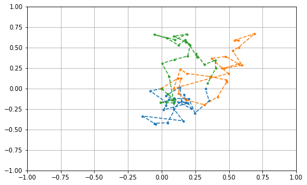
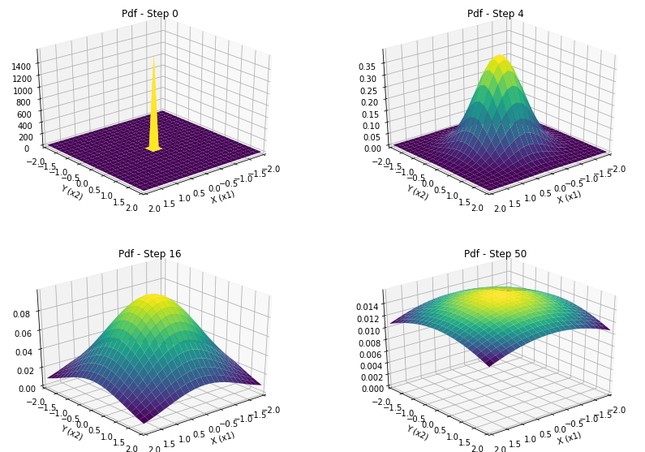

### Sumário

- Random walk - Variáveis gaussianas
- Simulando random walk
- Analisando a pdf de X em diferentes passos da random walk
- Porque randon walk são úteis
- Conclusão

### Random walk - Variáveis gaussianas

O random walk é um processo estocástico que descreve um caminho formado a sucessão de passos aleatórios. Vamos analisar um caso particular onde os passos aleatórios são dados por amostras de um variável aleatória com pdf gaussian.

$X_{i+1} = X_{i} + \eta_{i}$, onde $\eta$ ~ $N(\mu, \sigma^2)$

Ou seja, a cada passo nossa variável $X_i$ é somada a um passo aleatório. 

### Simulando random walk

Vamos ilustrar algumas random walk em duas dimênções.


```python
import numpy as np
import matplotlib.pyplot as plt
```


```python
gauss_1 = np.random.normal(0, 0.1, (2, 25))
gauss_2 = np.random.normal(0, 0.1, (2, 25))
gauss_3 = np.random.normal(0, 0.1, (2, 25))

walk_1 = np.c_[[0, 0], np.cumsum(gauss_1, 1)]
walk_2 = np.c_[[0, 0], np.cumsum(gauss_2, 1)]
walk_3 = np.c_[[0, 0], np.cumsum(gauss_3, 1)]
```


```python
fig = plt.figure(figsize=(8, 5))
plt.plot(walk_1[0, :], walk_1[1, :], '.--')
plt.plot(walk_2[0, :], walk_2[1, :], '.--')
plt.plot(walk_3[0, :], walk_3[1, :], '.--')
plt.xlim([-1, 1])
plt.ylim([-1, 1])
plt.grid()
```





Podemos notar que apesar dos três exemplos partirem da mesma posição cada caminho terminou sua caminhada em lugares muito distintos, de fato, quanto mais a caminhada continuasse maior a probabilidade dos caminhos terminarem em locais diferentes.

### Analisando a pdf de X em diferentes passos da random walk

Vamos analisar o comportamento da média e da variância ao longo das iterações da random walk, lembremos que a cada iteração somamos a variável $X_i$ um ruído aleatório com distribuição gaussiana e isso fará com que a pdf da variável aleatória para índices maiores seja diferente da anterior. Para iniciar nossa análise, vamos considerar que $X_0$ é uma v.a. com pdf gaussiana com $\mu = [0, 0]^T$ e $\Sigma = [[0, 0], [0, 0]]$.

Lembrando o que acontece quando somamos variáveis aleatória gaussianas temos:

$\mu_{i+1} = \mu_i + 0$, pois $\eta$ ~ $N(0, 0.1)$

e

$\sigma^2_{i+1} = \sigma^2_{i} + 0.1$

Ou seja, com o passar dos passos, a posição mais provável de terminar a caminhada ainda é a posição inicial, mas a variância aumenta a cada passo, o que indica que a probabilidades de terminarmos em outros lugar aumenta.

Vamos observar a pdf após algum no momento dos passos 


```python
from mpl_toolkits.mplot3d import Axes3D
```


```python
mu_0 = np.array([0, 0])
cov_0 = np.array([[1, 0], [0, 1]])*1e-4

mu_4 = np.array([0, 0])
cov_4 = np.array([[1, 0], [0, 1]])*(0.1*4)

mu_16 = np.array([0, 0])
cov_16 = np.array([[1, 0], [0, 1]])*(0.1*16)

mu_50 = np.array([0, 0])
cov_50 = np.array([[1, 0], [0, 1]])*(0.1*100)
```


```python
x_range = np.linspace(-2, 2, 25)
y_range = np.linspace(-2, 2, 25)
```


```python
grid_x, grid_y = np.meshgrid(x_range, y_range)
```


```python
grid_x_f = grid_x.reshape(-1, 1)
grid_y_f = grid_y.reshape(-1, 1)
```


```python
def multivariate_normal(x, mu, cov):
    det = np.linalg.det(cov)
    den = np.sqrt(((2*np.pi)**len(cov))*det)
    x_ = x-mu
    cov_inv = np.linalg.inv(cov)
    coef = np.multiply(np.dot(x_, cov_inv), x_)
    coef = np.sum(coef, 1)
    num = np.exp(-0.5*coef)
    return num/den
    
```


```python
grid = np.hstack([grid_x_f, grid_y_f])
```


```python
pdf_0 = multivariate_normal(grid, mu_0, cov_0)
pdf_0 = pdf_0.reshape(grid_x.shape)

pdf_4 = multivariate_normal(grid, mu_4, cov_4)
pdf_4 = pdf_4.reshape(grid_x.shape)

pdf_16 = multivariate_normal(grid, mu_16, cov_16)
pdf_16 = pdf_16.reshape(grid_x.shape)

pdf_50 = multivariate_normal(grid, mu_50, cov_50)
pdf_50 = pdf_50.reshape(grid_x.shape)
```


```python
fig = plt.figure(figsize=(14, 10))
ax = fig.add_subplot(221, projection='3d')
ax.plot_surface(grid_x, grid_y, pdf_1, cmap='viridis')
ax.view_init(elev=30, azim=50)
ax.set_title("Pdf - Step 0")
ax.set_xlabel("X (x1)")
ax.set_ylabel("Y (x2)")
ax.set_xlim([-2, 2])
ax.set_ylim([-2, 2])
ax.set_zlim([0, max(pdf_1.flatten())])
ax = fig.add_subplot(222, projection='3d')
ax.plot_surface(grid_x, grid_y, pdf_4, cmap='viridis')
ax.view_init(elev=30, azim=50)
ax.set_title("Pdf - Step 4")
ax.set_xlabel("X (x1)")
ax.set_ylabel("Y (x2)")
ax.set_xlim([-2, 2])
ax.set_ylim([-2, 2])
ax.set_zlim([0, max(pdf_4.flatten())])
ax = fig.add_subplot(223, projection='3d')
ax.plot_surface(grid_x, grid_y, pdf_16, cmap='viridis')
ax.view_init(elev=30, azim=50)
ax.set_title("Pdf - Step 16")
ax.set_xlabel("X (x1)")
ax.set_ylabel("Y (x2)")
ax.set_xlim([-2, 2])
ax.set_ylim([-2, 2])
ax.set_zlim([0, max(pdf_16.flatten())])
ax = fig.add_subplot(224, projection='3d')
ax.plot_surface(grid_x, grid_y, pdf_50, cmap='viridis')
ax.set_title("Pdf - Step 50")
ax.view_init(elev=30, azim=50)
ax.set_xlabel("X (x1)")
ax.set_ylabel("Y (x2)")
ax.set_xlim([-2, 2])
ax.set_ylim([-2, 2])
ax.set_zlim([0, max(pdf_50.flatten())])
```


    (0, 0.01591549430918953)





Podemos ver claramente que com o passar das iterações a pdf que antes era concentrada entorno no ponto inicil [0, 0] se distrui para mais longe da média. Isso mostra que a incerteza sobre a posição final da caminhada aumenta e a probabilidade dela terminar em pontos distântes da média aumenta.

### Porque randon walk são úteis

Pode parecer estranho analisar o comportamento de uma caminhada aleatória, porém sua aplicação é muito mais comum do que parece. Muitos processos com imperfeições podem ser modelados através de random walk. Tomamos como exemplo um processo linear representando no espaços de estados. Este tipo de processo é muito comum em sistemas de controle e processamento de sinais e pode ser descrito de forma genérica pelas equações:

$x(i+1) = Ax(i) + Bu(i)$, onde $u(i)$ é o sinal de controle e A é a matriz de transição de estado.

Porem, na prática é muito dificil modelar um sistema real com perfeição, para isso seria preciso conhecer a matriz A, a posição inical x(0) e o sinal de controle $u$ com precisão. Ná pratica é muito comum que os sistemas real respondam de forma diferente do teórico, podemos citar como exemplo o controle de um robo, ao comandarmos o robo para mover 1m a frente, devido a variação dos mecanismos internos do robo este provavelmente irá se mover 1m +-Xcm. Em seguida, se mandarmos ele se mover novamente 1m o mesmo aconceria e agora sua posição seria de 2m +-2Xcm, ou seja a incerteza sobre sua posição aumenta a cada comando novo e isso não é considerado na equação de espaço de estado.

Assim o processo seria melhor modelado se considerássemos que a dinâmica do sistema é na verdade descrita por uma random walk, dado pela equação:

$x(i+1) = Ax(i) + Bu(i) + \eta$, onde $\eta$ ~ $N(0, \sigma^2)$

Isso também nos ajuda a entender poque sistemas de controle em malha aberta não são usados na prática, pois a cada passo do processo estamos na verdade fazendo uma random walk a incerteza sobre o estado $x$ aumenta até o ponto em que as equações não refletem mais a realidade.

Em tópicos futuros vamos analisar como reduzir essa incerteza através do feedback com o filtro de Kalman.

### Conclusão

Neste tópico discutimos:
- O que é uma random walk
- Como simular uma random walk com v.a. gaussianas
- Como se comporta a pdf da variável aleatória X ao longo da random walk
- Porque random walk são úteis para modelar imprecisões em processos reais
